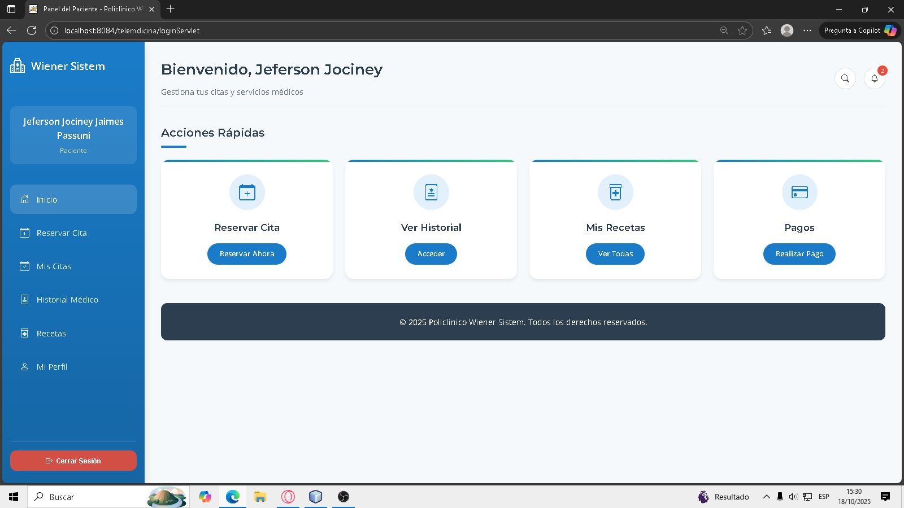
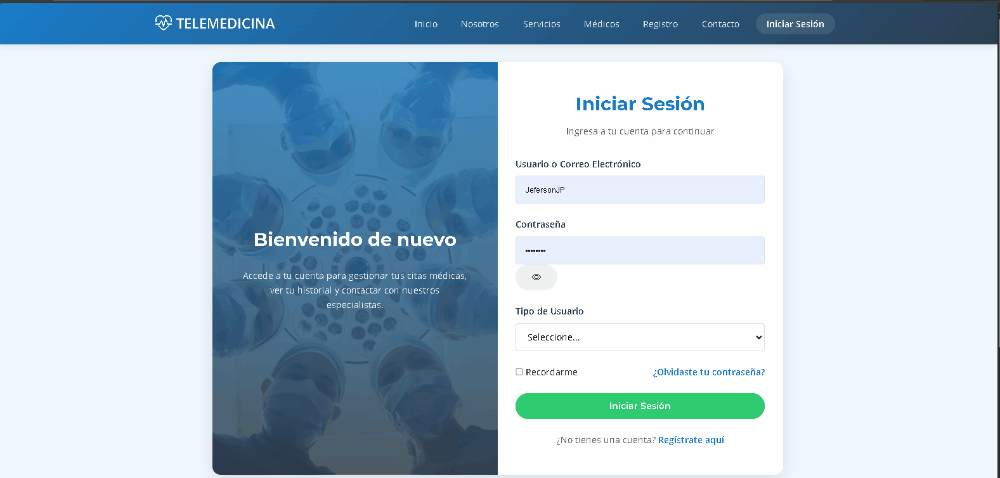
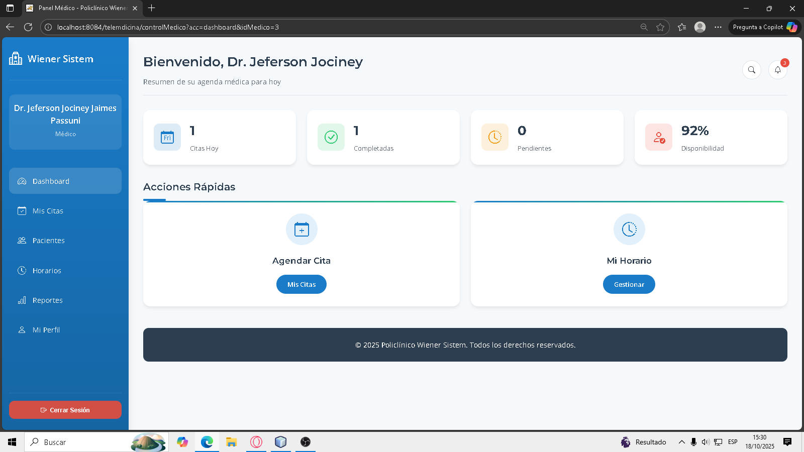
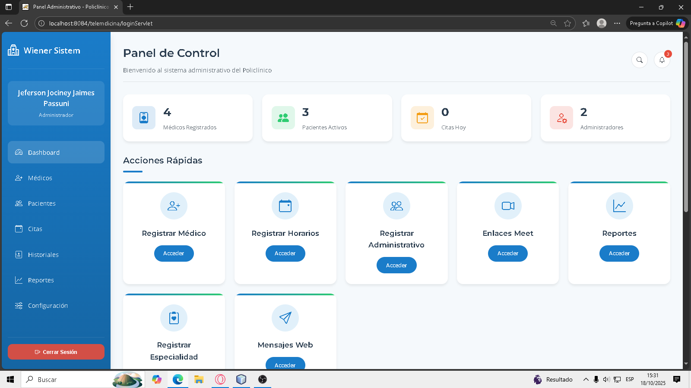
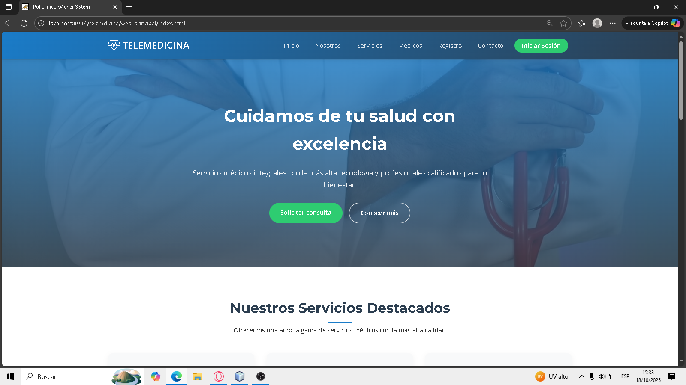
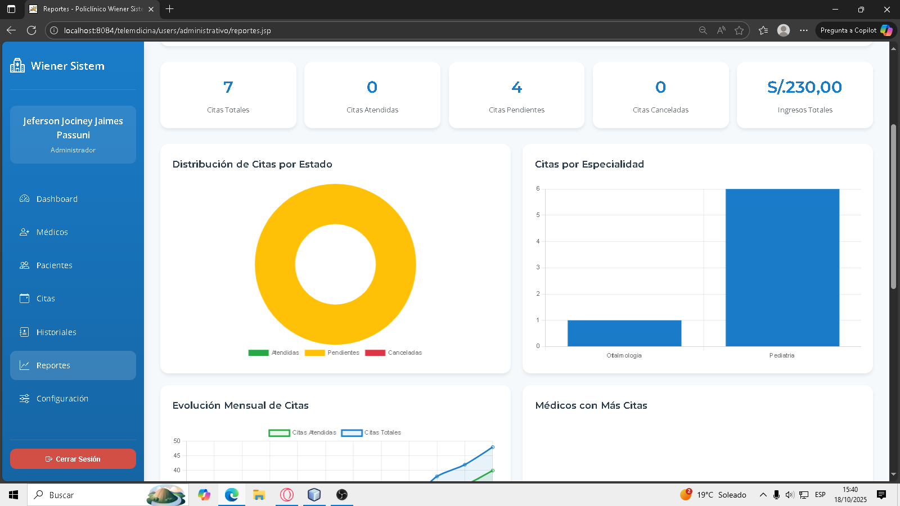
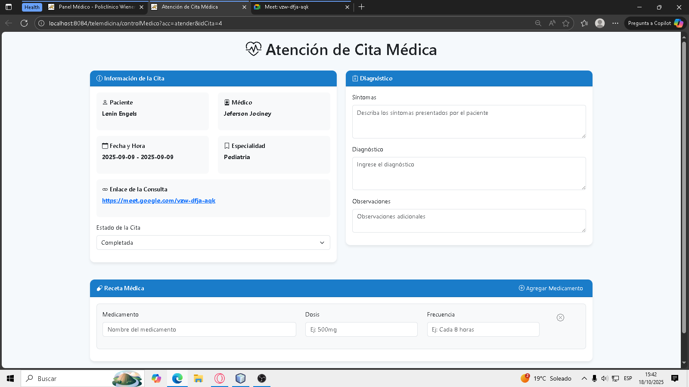
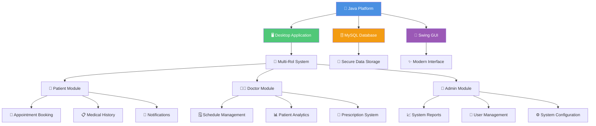
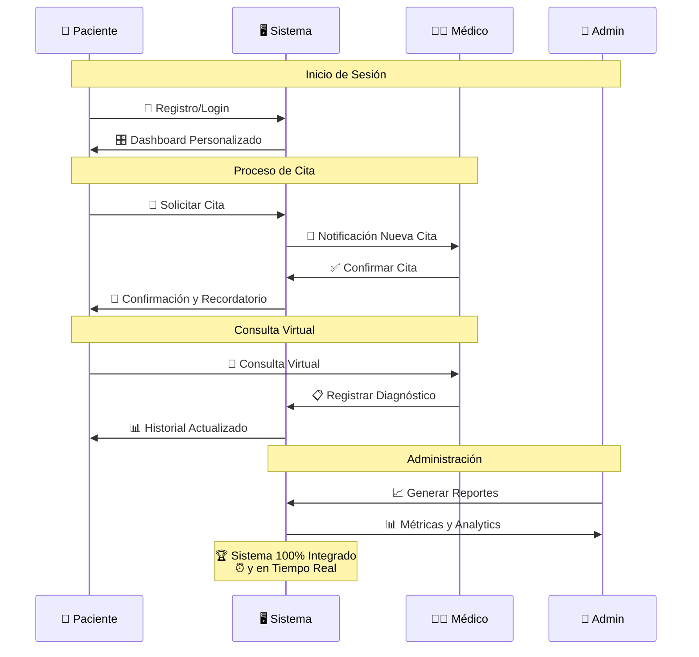

# 🏥💻 SISTEMA DE TELEMEDICINA 
### *Conexión Médica del Futuro - Aquí y Ahora*

*✨ Donde la tecnología se encuentra con el cuidado de la salud ✨*

---

## 🎨 **DEMOSTRACIÓN VISUAL**

### **📱 Vistas Principales del Sistema**

| Rol de Usuario | Vista del Sistema | Demostración en Tiempo Real |
|:---------------:|:-----------------:|:---------------------------:|
| **👤 Paciente** |  |  |
| **👨‍⚕️ Médico** |  |  |
| **👑 Administrador** |  |  |

### **⚡ Funcionalidades Específicas**

| Módulo | Interfaz | Comportamiento |
|:------:|:--------:|:--------------:|
| **🏠 Principal** |  |  |
| **📊 Reportes** |  | *Sistema de reportes avanzado* |
| **💬 Consultas** |  | *Comunicación en tiempo real* |

---

## ✨ **ARQUITECTURA DEL SISTEMA**

---
## 🚀 **CARACTERÍSTICAS PRINCIPALES**

### **🎯 Módulos Especializados por Rol**

<table>
<tr>
<td width="33%" valign="top" style="border-radius: 15px; padding: 20px; background: linear-gradient(135deg, #667eea 0%, #764ba2 100%); color: white;">

### 🌟 **MÓDULO PACIENTE**

🫀 **Gestión Personal de Salud**

- 📅 **Agendamiento Inteligente**
  - ⚡ Sistema de citas 24/7
  - 🔔 Recordatorios automáticos
  - 🔄 Cancelación flexible

- 🏥 **Historial Médico Digital**
  - 📋 Acceso completo a historial
  - 🧪 Resultados de exámenes
  - 💊 Medicamentos recetados

- 🔔 **Comunicación Directa**
  - 💬 Mensajería con médicos
  - 🚨 Alertas importantes
  - 📱 Notificaciones push

</td>

<td width="33%" valign="top" style="border-radius: 15px; padding: 20px; background: linear-gradient(135deg, #f093fb 0%, #f5576c 100%); color: white;">

### 💼 **MÓDULO MÉDICO**

🩺 **Herramientas Profesionales**

- 🗓️ **Gestión de Agenda**
  - 📊 Vista calendario integrada
  - ⏰ Control de disponibilidad
  - 🎯 Optimización de tiempo

- 📊 **Dashboard Clínico**
  - 📈 Métricas de pacientes
  - 🩺 Indicadores de salud
  - 📋 Reportes automáticos

- 💡 **Herramientas Diagnósticas**
  - 📝 Prescripción digital
  - 🗒️ Notas médicas
  - 🔍 Seguimiento tratamiento

</td>

<td width="33%" valign="top" style="border-radius: 15px; padding: 20px; background: linear-gradient(135deg, #4facfe 0%, #00f2fe 100%); color: white;">

### 👑 **MÓDULO ADMINISTRADOR**

⚙️ *Control Total del Sistema*

- 📈 **Analítica Avanzada**
  - 📊 Reportes del sistema
  - 📱 Métricas de uso
  - 🎯 KPIs de rendimiento

- 👥 **Gestión de Usuarios**
  - 👤 Altas y bajas
  - 🔐 Permisos y roles
  - 📋 Auditoría completa

- 🔧 **Configuración**
  - ⚙️ Parámetros del sistema
  - 💾 Backup automático
  - 🛡️ Seguridad y acceso

</td>
</tr>
</table>

---

## 🛠 **TECNOLOGÍAS IMPLEMENTADAS**

<table>
<tr>
<td align="center" width="25%" style="border-radius: 10px; padding: 15px; background: #f8f9fa; border: 2px solid #4A90E2;">

### **🖥️ Frontend**

**✨ Interfaz desktop moderna y responsive**

</td>

<td align="center" width="25%" style="border-radius: 10px; padding: 15px; background: #f8f9fa; border: 2px solid #ED8B00;">

### **⚙️ Backend**

**🚀 Arquitectura robusta y escalable**

</td>

<td align="center" width="25%" style="border-radius: 10px; padding: 15px; background: #f8f9fa; border: 2px solid #005C84;">

### **🗄️ Base de Datos**

**💾 Almacenamiento seguro y eficiente**

</td>

<td align="center" width="25%" style="border-radius: 10px; padding: 15px; background: #f8f9fa; border: 2px solid #9B59B6;">

### **🚀 Características**

**🎯 Sistema integral y en tiempo real**

</td>
</tr>
</table>

---

## 📊 **FLUJO DE TRABAJO**

---
## 🎯 **BENEFICIOS CLAVE**

<table>
<tr>
<td align="center" width="50%" style="border-radius: 15px; padding: 25px; background: linear-gradient(135deg, #667eea 0%, #764ba2 100%); color: white;">

### 🏥 Para Instituciones de Salud

- ✅ **Reducción de costos** operativos
- ✅ **Optimización** de recursos médicos  
- ✅ **Digitalización** completa de procesos
- ✅ **Escalabilidad** del sistema
- ✅ **Reportes** en tiempo real
- ✅ **Mejora** en calidad de servicio

</td>

<td align="center" width="50%" style="border-radius: 15px; padding: 25px; background: linear-gradient(135deg, #f093fb 0%, #f5576c 100%); color: white;">

### 👥 Para Usuarios y Pacientes

- ✅ **Acceso 24/7** desde cualquier lugar
- ✅ **Tiempos de espera** reducidos
- ✅ **Historial médico** siempre disponible
- ✅ **Comunicación directa** con médicos
- ✅ **Experiencia** personalizada
- ✅ **Seguridad** de datos garantizada

</td>
</tr>
</table>

 

 

*💫 Innovando en telemedicina desde 2024*

### **📞 ¿Preguntas o Colaboraciones?**

¡No dudes en contactarnos para implementar este sistema en tu institución!

 

 

**👨‍💻 Desarrollado con ❤️ por [Jeferson Jociney Jaimes Passuni](https://github.com/JAIMES4224D)**

