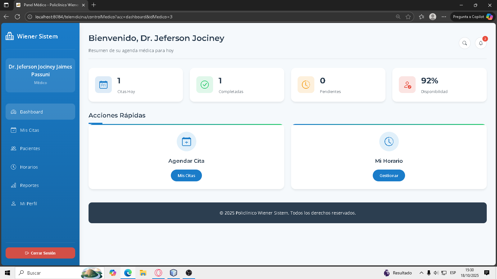

<!-- HEADER CON GRADIENTE ANIMADO -->
<div align="center">

# 🏥💻 SISTEMA DE TELEMEDICINA 
### *Conexión Médica del Futuro - Aquí y Ahora*


*✨ Donde la tecnología se encuentra con el cuidado de la salud ✨*

</div>

---

## 🌟 **GALERÍA VISUAL**

<div align="center">

| | |
|:-------------------------:|:-------------------------:|
| **🎭 Interfaz Principal** | **📊 Dashboard Médico** |
|  |  |
| **👥 Gestión Pacientes** | **📱 Consultas Virtuales** |
|  |  |

</div>

---

## 🚀 **CARACTERÍSTICAS DESTACADAS**

<div align="center">

### 🎯 **Módulos Principales**

</div>

<table>
<tr>
<td width="33%">

### 👨‍⚕️ **MÓDULO MÉDICO**
- 🎯 Perfiles profesionales completos
- 📊 Dashboard de rendimiento
- 🕒 Gestión inteligente de tiempo
- 📈 Reportes automáticos

</td>
<td width="33%">

### 👨‍💼 **MÓDULO PACIENTES**
- 👤 Historias clínicas digitales
- 💊 Seguimiento de tratamientos
- 🔔 Recordatorios automáticos
- 📱 Acceso multiplataforma

</td>
<td width="33%">

### ⚡ **MÓDULO CITAS**
- 🎯 Sistema de agendamiento inteligente
- 🔄 Remisiones automáticas
- 📅 Calendario integrado
- ⏰ Alertas en tiempo real

</td>
</tr>
</table>

---

## 🛠 **TECNOLOGÍAS IMPULSADORAS**

<div align="center">

```mermaid
graph TD
    A[Java SE] --> B[NetBeans IDE 8.2]
    A --> C[MySQL Database]
    A --> D[Swing/AWT GUI]
    
    B --> E[📱 Desktop App]
    C --> F[💾 Data Management]
    D --> G[🎨 Modern UI]
    
    E --> H[🚀 Sistema Telemedicina]
    F --> H
    G --> H
